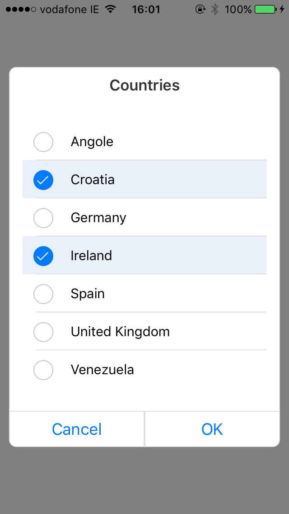

# SwiftCheckboxDialog

[](http://cocoapods.org/pods/SwiftCheckboxDialog)
[](http://cocoapods.org/pods/SwiftCheckboxDialog)
[](http://cocoapods.org/pods/SwiftCheckboxDialog)

## Overview

SwiftCheckboxDialog is a simple dialog that contains multiple select checkboxes, written in Swift 3 and xCode 8.2.1



## Requirements
* ARC
* iOS10

## Installation with CocoaPods

SwiftCheckboxDialog is available through [CocoaPods](http://cocoapods.org). To install
it, simply add the following line to your Podfile:

```ruby
pod "SwiftCheckboxDialog"
```

## Usage

```Swift
import SwiftCheckboxDialog

class ViewController: UIViewController, CheckboxDialogViewDelegate {
    var checkboxDialogViewController: CheckboxDialogViewController!

    //define typealias-es
    typealias TranslationTuple = (name: String, translated: String)
    typealias TranslationDictionary = [String : String]

    override func viewDidLoad() {
    super.viewDidLoad()
        // Do any additional setup after loading the view, typically from a nib.
    }

    override func didReceiveMemoryWarning() {
    super.didReceiveMemoryWarning()
        // Dispose of any resources that can be recreated.
    }

    @IBAction func onButtonPressed(_ sender: UIButton) {
        // this tuple has translated key because it can use localized values in case app needs to be localized
        let tableData :[(name: String, translated: String)] = [("Angola", "Angole"),
                                                                ("Croatia", "Croatia"),
                                                                ("Germany", "Germany"),
                                                                ("Ireland", "Ireland"),
                                                                ("Spain", "Spain"),
                                                                ("United Kingdom", "United Kingdom"),
                                                                ("Venezuela", "Venezuela")]


        self.checkboxDialogViewController = CheckboxDialogViewController()
        self.checkboxDialogViewController.titleDialog = "Countries"
        self.checkboxDialogViewController.tableData = tableData
        self.checkboxDialogViewController.defaultValues = [tableData[3]]
        self.checkboxDialogViewController.componentName = DialogCheckboxViewEnum.countries
        self.checkboxDialogViewController.delegateDialogTableView = self
        self.checkboxDialogViewController.modalPresentationStyle = UIModalPresentationStyle.overCurrentContext
        self.present(self.checkboxDialogViewController, animated: false, completion: nil)
    }

    func onCheckboxPickerValueChange(_ component: DialogCheckboxViewEnum, values: TranslationDictionary) {
        print(component)
        print(values)
    }
}
```

## Example Project

An example project is included with this repo.  To run the example project, clone the repo, and run `pod install` from the Example directory first.

## Author

Kristijan Kontus, kristijan.kontus@gmail.com

## License

SwiftCheckboxDialog is available under the MIT license. See the LICENSE file for more info.
